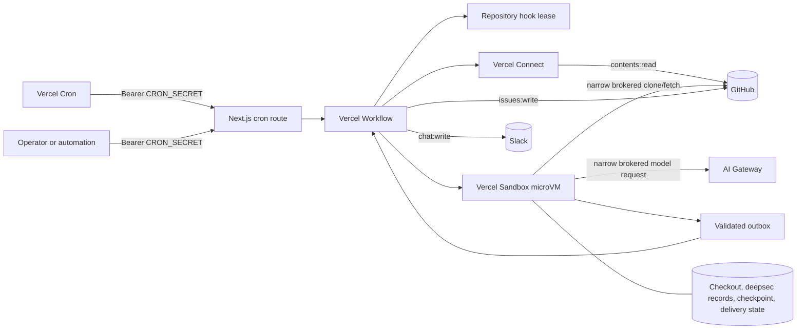

# deepsec Runner architecture

deepsec Runner is a control plane for recurring security analysis. It separates trusted orchestration and publication from untrusted repository execution. This document describes the production architecture, not the deepsec analyzer internals.

## Goals

- Scan private or public GitHub repositories on schedules from daily to once per minute, subject to the Vercel plan.
- Keep long analysis resumable across function and Sandbox session boundaries.
- Prevent overlapping runs for the same repository without a database.
- Keep reusable credentials outside the untrusted microVM.
- Write only GitHub issues and Slack messages; never modify scanned repositories.
- Fail visibly, retry transient external failures, and preserve pending work for a later run.
- Avoid duplicate GitHub issues and Slack messages after retries or ambiguous responses.

## Non-goals

- A live fleet dashboard or long-term analytics warehouse
- Pull-request remediation, commits, branches, or repository writes
- A general-purpose job queue or multi-tenant public API
- Private vulnerability disclosure workflows
- Organization-wide quotas or durable trigger accounting

Adding any of these capabilities requires new product and security decisions. Do not approximate them with process memory or Sandbox state.

## System overview



Workflow is the trusted control plane. It receives static configuration and owns credentials, concurrency, validation, and external side effects. Sandbox receives repository content and runs the analyzer, so everything it writes is treated as untrusted data.

## Why each Vercel product is present

| Product | Responsibility | Why it is needed |
| --- | --- | --- |
| Next.js | Hosts the authenticated Cron HTTP route plus a static policy summary | Vercel Cron and operators need a small trigger surface. It does not orchestrate scans. |
| Vercel Cron | Starts configured repositories on UTC schedules | Scheduling is kept separate from execution. Each request only enqueues Workflow. |
| Vercel Workflow | Durable steps, retries, sleeps, run identity, and repository hook leases | A scan outlives ordinary request execution. Workflow also keeps trusted coordination outside the untrusted filesystem. |
| Vercel Sandbox | Firecracker microVM isolation, controlled egress, persistent snapshots, and bounded compute | Repository source and agent instructions are untrusted and need a real process and filesystem boundary. |
| Vercel Connect | Exchanges project identity for short-lived GitHub and Slack tokens | The project stores connector locators, not GitHub App keys or Slack bot tokens. Tokens are requested only for the action being performed. |
| AI Gateway | Model routing, authentication, usage visibility, and budgets | deepsec supports several agents and models. Gateway provides one controlled model egress and a spend boundary. |

The runner does not require Postgres, Redis, Blob, or Queue. Workflow owns durable run execution, while Sandbox owns repository-local working state. Add another store only when a concrete requirement introduces shared or historical state.

## Execution sequence

### Trigger and admission

1. Vercel Cron or an operator calls `GET /api/cron/deepsec/<repoId>` with `Authorization: Bearer $CRON_SECRET`.
2. The route authenticates before resolving the repository or calling `start`.
3. The route starts `deepsecRepositoryWorkflow` and returns `202` with the Workflow run ID.

### Coordination and preparation

1. A trusted step resolves the repository from `src/config/repositories.ts`; arbitrary request values cannot select a GitHub target.
2. Runtime configuration is validated before compute starts. Slack, Gateway, GitHub, and issue-marker requirements depend on the repository policy.
3. Workflow creates a deterministic hook lease named `deepsec:<repoId>`.
4. If another active Workflow owns the token, the new run sends an `already-running` Slack result containing the active run ID and exits. The lease releases automatically when the owner ends.
5. For authenticated clones, Connect requests a token narrowed to the configured repository and `contents:read`.
6. Workflow creates or resumes the repository’s named persistent Sandbox and reapplies its current resources, tags, retention, and network policy.

### Analysis in Sandbox

1. Workflow writes a runner program and trusted repository configuration into `/vercel/sandbox/runner`.
2. The runner verifies that a persistent checkout’s `origin` still matches the configured repository.
3. It clones or fetches the configured branch and resets the working tree to the remote target commit. It never pushes.
4. An incremental run selects added, modified, renamed, and copied files between the last successful SHA and the target SHA. A first run selects every tracked file.
5. Default and configured ignore globs remove generated output, dependencies, fixtures, and other excluded paths.
6. The runner installs the exact configured deepsec version into persistent working state, writes deepsec configuration and repository context, and processes unfinished files.
7. File history and `checkpoint.json` identify completed files. Interrupted files are retried after a session rollover.
8. Sandbox progress files are telemetry only. Workflow uses the Sandbox control-plane command lifecycle, not a VM-writable file, to decide when the runner has exited.
9. deepsec exit `0` is accepted. Exit `1` is accepted only when a non-empty findings report exists; otherwise it is treated as an agent, quota, or credential failure. Other exits fail.
10. The runner writes a structured outbox and progress record. It cannot choose the publication repository or send the result itself.

### Trusted publication and completion

1. A trusted step reads and validates the bounded outbox with Zod, checks its repository and branch against static configuration, and returns only counts and commit metadata to durable Workflow state. Raw findings remain local to the consuming publication step.
2. A findings run with `issuePublication: "required"` requests a separate one-repository `issues:write` token and consumes the raw report inside that trusted step.
3. GitHub publication creates or updates the issue identified by an HMAC-protected repository-and-commit marker and the authenticated GitHub App author. A matching closed issue is reopened. Copying a visible marker into an attacker-authored issue cannot redirect a retry.
4. Workflow sends the terminal Slack notification. GitHub-backed runs include counts, severities, and the issue link without duplicating the findings body; only an explicit `slack-only` policy consumes and sends the bounded report. Transient failures become Workflow retries; rate limiting respects Slack’s `Retry-After` response.
5. Only after GitHub publication and Slack delivery succeed does Workflow set `lastPublishedSha`.
6. Workflow stops the Sandbox. A persistent Sandbox snapshots on stop and retains one latest snapshot.
7. The repository hook lease releases when the Workflow returns or fails.

## Trust boundaries

### Trusted

- Source-controlled repository policies and the programmatic `vercel.ts` configuration
- Authenticated Next.js routes after bearer validation
- Workflow steps and durable orchestration state
- Vercel Connect token exchange
- Sandbox network-policy control plane
- Outbox schema validation and trusted publication code

### Untrusted

- Repository contents and Git history
- Dependency metadata and package lifecycle behavior
- `AGENTS.md`, source comments, prompts, and other agent-readable instructions in scanned repositories
- deepsec subprocesses and their tool use
- Model output, deepsec records, checkpoints, progress, and outbox contents

The Sandbox is allowed to compute a proposed result. It is never allowed to select credentials, publication targets, or external side effects.

## Credential brokering

The Sandbox firewall brokers credentials. The real credential remains in Workflow and the Vercel Sandbox control plane, while the microVM sees a known placeholder. Each rule matches the expected host, method, path, and placeholder header.

| Credential | Exists in Sandbox? | Broker rule or use |
| --- | --- | --- |
| GitHub installation token | No | Injected only for `GET`/`POST` Git smart-HTTP clone and upload-pack paths belonging to the configured repository, and only when the expected placeholder Authorization header is present |
| AI Gateway key | No | Injected only for `POST /v1/*` when the expected placeholder Bearer header is present |
| Slack token | No | Used only by the trusted `chat.postMessage` step |
| `DEEPSEC_MARKER_SECRET` | No | Used only by trusted GitHub publication to compute the HMAC marker |
| `CRON_SECRET` | No | Used only at the HTTP admission boundary |

Placeholder values are public sentinels, not credentials. Matching them prevents unrelated allowed-host traffic from receiving a real credential. An attacker running inside the Sandbox can still spend through the intended AI Gateway interface, so AI Gateway budgets and Vercel usage alerts remain necessary controls.

GitHub and npm remain reachable during analysis because the runner may need fetches and package installation before deepsec starts. The GitHub credential transform is repository- and path-scoped, and npm receives no credential. If policy requires a smaller network surface, a two-phase runner could remove GitHub and npm egress after bootstrap and before agent execution.

### AI Gateway authentication

At Vercel Function runtime, OIDC is delivered on the request context and has a short TTL. The scan continues in later Workflow step requests, so the runner uses a revocable, budgeted `AI_GATEWAY_API_KEY` instead of retaining or serializing the initiating token. Local OIDC still authenticates Vercel SDK and Connect operations after `vercel env pull`; it is not a model credential fallback.

## State and recovery

| State | Owner | Contents | Recovery behavior |
| --- | --- | --- | --- |
| Workflow run | Workflow | Step results, retries, sleeps, run ID, terminal status, bounded delivery metadata | Durable across function executions and deployments supported by Workflow; raw finding bodies are not step results or arguments |
| Repository lease | Workflow hook | One active owner for `deepsec:<repoId>` | Conflict returns the active run ID; automatic release at terminal state |
| Persistent Sandbox | Sandbox | Git checkout, installed deepsec version, deepsec records, runner files | Restored from the latest snapshot on the next session or run |
| `checkpoint.json` | Sandbox | Target SHA, file set, starting analysis counts, completed files, deepsec run IDs | Skips completed files and reclaims interrupted work |
| `state.json` | Sandbox | `lastSuccessfulSha`, `lastPublishedSha`, timestamps | Separates completed analysis from completed delivery |
| `outbox.json` | Sandbox, consumed inside trusted publication steps | Validated status, commit range, files, counts, summary | Replayed while target SHA is successful but not published; its raw summary is not returned into durable Workflow state |
| GitHub issue marker | GitHub | HMAC of repository ID and target SHA | Makes retries idempotent and prevents predictable-marker hijacking |
| Slack `client_msg_id` | Slack | Deterministic ID derived from Workflow step ID | Makes ambiguous delivery retries idempotent |

`lastSuccessfulSha` advances only after every selected file completed trustworthy analysis. `lastPublishedSha` advances later, after required GitHub and Slack delivery. If delivery exhausts retries, the Workflow fails but the outbox remains pending. A later incremental run at the same target SHA replays that outbox instead of converting the result into `no-changes`.

Pending incremental delivery is a hard barrier even when the remote branch has advanced. The runner replays the prior outbox before analyzing newer source, so one persistent outbox cannot be overwritten before GitHub and Slack accept it.

## Sandbox sessions

One Workflow may use up to three Sandbox sessions. The poll loop stops a session two minutes before its configured timeout so Vercel can snapshot it. The next loop iteration resumes the same named Sandbox and the runner refreshes its checkpoint before continuing.

The Sandbox name is derived from both the policy ID and normalized repository name. Retargeting an ID creates a separate Sandbox identity, and every run still verifies the checkout origin before fetch.

Snapshot retention preserves one latest snapshot. Keeping more snapshots adds cost and is not used for application-level rollback; Git and deepsec records already provide the needed recovery history.

## Failure semantics

| Failure | Behavior |
| --- | --- |
| Missing required runtime configuration | Fatal before repository lease or Sandbox compute |
| Invalid or disabled repository ID | Workflow fails without external repository access |
| Existing repository lease | Sends `already-running` and exits without touching Sandbox |
| Transient Slack or provider failure | Workflow retries the trusted step; Slack retry delay is honored |
| Permanent Slack failure | Workflow remains failed and the outbox is not marked delivered |
| GitHub publication failure | Workflow fails; the outbox remains pending for replay |
| Sandbox runner failure | Sends `failed` when Slack is reachable, stops Sandbox, preserves checkpoint |
| Three sessions exhausted | Sends `timed-out`, stops Sandbox, preserves checkpoint for a later run |
| deepsec refuses or skips selected files | Fails closed; the baseline does not advance |
| No changed files with a pending outbox | Replays the previous terminal result |
| No changed files after completed delivery | Emits `no-changes` |

Failure notification can also fail if Slack is misconfigured or unavailable. In that case, the Workflow failure remains visible in Vercel observability. Run `pnpm verify:setup` before enabling schedules to confirm Slack delivery.

## Scaling

Repository policies are static source configuration so deployments are reviewable and no database is needed. During deployment, `vercel.ts` maps each enabled policy to one Cron job. One Vercel project supports up to 100 Cron jobs.

For fleets larger than 100 scheduled repositories:

1. Deploy multiple Vercel projects from the template.
2. Partition repository policies between projects.
3. Attach each project only to the connectors and GitHub repositories in its partition.
4. Use unique Gateway keys or project budgets for cost attribution.
5. Keep repository IDs unique within a project; cross-project coordination is not provided.

Sharding scales the scheduled fleet but does not provide centralized management. Add a trusted control-plane store and dispatcher when teams need one catalog, organization-wide quotas, historical coverage reporting, or cross-project scheduling. Do not place that state in Sandbox.

## Security invariants

Changes must preserve these properties:

1. Authenticate every trigger before calling Workflow `start`.
2. Resolve the GitHub repository only from validated static configuration.
3. Acquire Workflow concurrency before creating or resuming a Sandbox.
4. Never place real GitHub, Slack, Gateway, OIDC, trigger, or marker credentials in Sandbox environment variables, files, commands, or logs.
5. Keep network transforms narrowed to the expected host, method, path, and placeholder header.
6. Bound and validate every outbox in a trusted step before any external write; bind its repository and branch to static configuration and keep its raw findings body out of durable Workflow state.
7. Keep GitHub and Slack writes outside Sandbox.
8. Do not grant repository content-write permissions to this analysis workflow.
9. Advance the analysis baseline only after complete analysis, and delivery state only after all required external delivery.
10. Give every retried external write a deterministic idempotency identifier and bind GitHub issue reuse to the authenticated App author.
11. Keep operational logs and external-provider errors sanitized and private; findings may contain sensitive source context. Do not copy GitHub-backed finding bodies into Slack.
12. Treat a missing notification as a failed run, not a successful scan.

## Operational limits and next steps

Repository-local recurring scans do not require Postgres. Add the following controls only when they meet a concrete need:

- **Central reporting:** Add a trusted Postgres or analytics sink when historical coverage, fleet search, ownership, SLA metrics, or cost attribution becomes a requirement.
- **Sensitive findings:** Replace ordinary issues with GitHub private vulnerability reporting, security advisories, or an internal vulnerability platform.
- **Network minimization:** Split bootstrap and analysis into separate phases if policy requires removing GitHub and npm egress before the agent starts.
- **More than 8 vCPUs:** Raise the schema limit only after validating Enterprise Sandbox settings and deepsec concurrency behavior.
- **More than 100 schedules:** Shard deployments or add a trusted scheduler/control plane.
- **Automated remediation:** Build a separate approval-gated workflow with its own write-scoped GitHub connector. Do not expand this analysis Sandbox’s permissions.

## Verification

The repository’s standard gate is:

```bash
pnpm check
```

It type-checks the programmatic Vercel configuration, runs tests, and builds Next.js plus Workflow. Connector and Slack delivery verification is separate because it uses live project access and sends a real message:

```bash
pnpm verify:setup
```

Security review should also run deepsec against this repository after changes to authentication, Workflow ordering, Sandbox policy, state transitions, outbox validation, or external publication.
